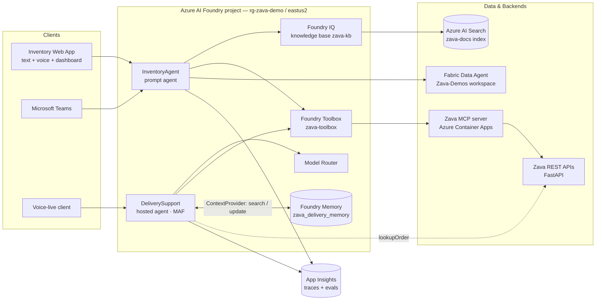
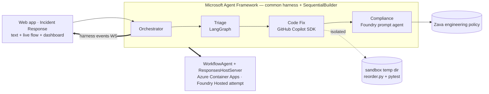

# Zava Foundry Demos — Architecture

> This document is expanded by the `architecture-diagrams` workstream. It captures the target
> architecture, the components, and the main data flows for the two agents.

## 1. Component overview

## 2. InventoryAgent (prompt agent) — request flow

1. A user asks a question in the **web app** (text or voice via **Voice Live**) or in **Teams**.
2. The **prompt agent** decides which tool(s) to use:
   - **Foundry IQ knowledge base** (`zava-kb`) → plans the query over the **Azure AI Search** `zava-docs`
     index and returns a **synthesised answer with citations** for policy/manual/FAQ questions.
   - **Fabric Data Agent** (`fabric_dataagent_preview`) → aggregate/analytical questions over the semantic model.
   - **Zava toolbox** (`zava-toolbox`) → live inventory/stock lookups against the **Zava REST APIs** over MCP.
3. The dashboard renders current inventory KPIs pulled from the Zava API.
4. Traces + evaluation signals flow to **App Insights**.

## 3. DeliverySupport (hosted agent, Microsoft Agent Framework) — request flow

1. A customer asks about an order (text or **Voice-live**).
2. The agent runs on the **Model Router** deployment (cost/quality routing).
3. Before the model runs, a MAF **`ContextProvider`** searches **Foundry Memory** for that customer's
   **scope** and appends the recalled profile facts + conversation summaries to the run instructions.
4. It calls the **`lookupOrder`** tool (Zava APIs / MCP) to fetch order + shipment status.
5. **Session memory** preserves context across turns *within* the conversation; after the turn the provider
   hands the transcript back to Foundry (`begin_update_memories`), which extracts durable memories
   asynchronously so the next *conversation* starts already knowing the customer.
6. **Traces**, **batch evaluations**, and **continuous evaluations** are captured in **App Insights**.

**Memory scoping.** One **scope** = one customer, and search/delete are always scoped, so customers never
see each other's memories. The demo pins `DELIVERY_MEMORY_SCOPE`; a production app passes the signed-in
user id. Memories expire after `DELIVERY_MEMORY_TTL_DAYS` idle days. The web app reads the same store
read-only (`GET /api/memory`) and can wipe a scope for clean demo runs (`DELETE /api/memory`).

## 4. Environments & resources

| Concern | Resource |
|---------|----------|
| Resource group | `rg-zava-demo` (East US 2) |
| Foundry project | new AI Services account + project |
| Models | `gpt-4.1`, `model-router`, `text-embedding-3-large`, `gpt-realtime` |
| Knowledge base | Foundry IQ knowledge base `zava-kb` over Azure AI Search (`zava-docs`) |
| Analytics | Fabric workspace `Zava-Demos` (F8) + Fabric Data Agent `ZavaDataAgent` |
| Tools | Foundry Toolbox `zava-toolbox` → Zava MCP server (Container Apps) |
| Backends | Zava REST APIs + MCP server (Azure Container Apps) |
| Observability | Application Insights |

## 5. Security & identity notes

- Prefer **keyless / managed identity** auth. Note the **project** managed identity is *not* the account
  managed identity — `RemoteTool` connections (Foundry IQ KB, toolbox) authenticate as the **project** MI,
  which needs `Foundry User` on the Foundry account and `Search Index Data Reader` on AI Search.
- Foundry accepts **remote** MCP endpoints only → the Zava MCP server is deployed to Container Apps.
- The **Fabric Data Agent** is attached with `MicrosoftFabricPreviewTool` (`fabric_dataagent_preview`) via a
  **CustomKeys** connection. The older `fabric_iq_preview` tool needs a *delegated user* token (Entra app +
  tenant admin consent) and is **not** used. Fabric items must be **published**.
- A **failing MCP tool endpoint takes the whole agent down** — Foundry resolves every tool endpoint on every
  request, so one `401` surfaces as `tool_user_error` for all questions.
- **Teams** publishing uses the project managed identity (MCP identity passthrough is not supported in Teams).

## 6. Demo #2 — Multi-framework orchestration (MAF + Foundry Hosted Agents)

A separate demo (`agents/incident-orchestration/`) resolves a **Zava engineering incident** (the nightly
reorder service produced negative quantities) using three agents built with **different frameworks**, wrapped
behind a common Microsoft Agent Framework (MAF) harness and orchestrated as a deterministic pipeline.

**Flow.** (1) The incident text enters the pipeline. (2) **Triage** (a LangGraph `StateGraph`) classifies
severity/category/component and routes. (3) **Code Fix** (the GitHub Copilot SDK) runs a real
*plan → execute (shell/fs) → assess → iterate* harness on a **fresh temp copy** of the seeded sandbox until
`pytest` is green, returning a diff + test result. (4) **Compliance** (a Foundry prompt agent) reviews the
diff against the Zava engineering policy and returns an approve / needs-changes decision.

**Harness & events.** Each framework is exposed to MAF via a uniform `BaseChatClient` adapter (the *common
Agent Harness*), and every step is published on an `EventBus`. The web app runs the workflow **in-process**
and streams those events over a WebSocket to animate the flow diagram and per-agent dashboard in real time.

**Harness capabilities.** That uniform surface is what makes two MAF harness capabilities work across all
three frameworks at once:

- **Todo provider** — a MAF `TodoProvider` bound to a custom `SharedTodoStore` (it ignores `AgentSession`
  so the three stages share *one* list). Triage writes a 4-item remediation plan, Code Fix completes items
  from real signals (`pytest_runs`, `files_changed`, `test_passed`), and Compliance completes the review
  item or **appends** its `required_changes`. Each mutation emits `todo_updated`, which the web app renders
  as a live checklist.
- **OpenTelemetry** — `setup_observability()` calls `configure_otel_providers()` with the Azure Monitor
  trace/log/metric exporters. Because LangGraph, the Copilot SDK and the Foundry prompt agent all reach MAF
  through `BaseChatClient`, instrumenting MAF yields **one** distributed GenAI trace in Application Insights.
  It is idempotent, never raises, and `OTEL_SENSITIVE_DATA` gates prompt/completion capture.

**Hosting.** `build_incident_agent()` wraps the workflow as a single `WorkflowAgent`, served by
`ResponsesHostServer` (`main.py`). It is deployed to **Azure Container Apps** (`ORCHESTRATION_AGENT_ENDPOINT`)
as the verified runtime — a Foundry Hosted Agent deploy is attempted the same way (the hosted Responses
runtime has the same preview tool-arg limitation seen with DeliverySupport). The Code Fix (Copilot SDK) step
uses the logged-in GitHub Copilot CLI user locally, or a `GITHUB_TOKEN` with Copilot access in a container.
